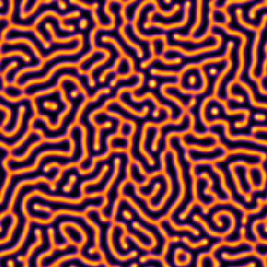

# Reaction Diffusion

Simulates reaction diffusion system in JuliaLang and live renders the output, using GLMakie. 

Download the `reactiondiffusionminimal.ipynb` notebook and run all cells.  

More models and functions to save the results as gifs, are available in the `reactiondiffusionancillary.ipynb` file (though very disorganized).